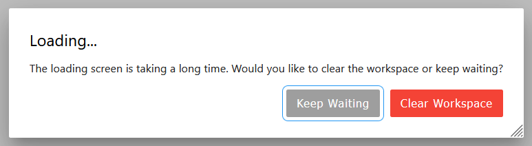
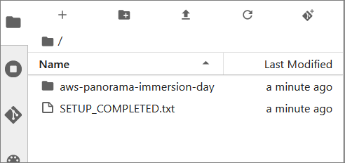

# AWS Panorama Immersion Day contents

## How to set up

1. Create a CloudFormation stack with [this template file](./cloudformation/cf-panorama-workshop.yaml).
    ```
    $ aws cloudformation create-stack \
    --template-body file://./cloudformation/cf-panorama-workshop.yaml \
    --capabilities CAPABILITY_IAM \
    --stack-name panorama-workshop-1
    ```
1. Visit [SageMaker Notebooks instances page](https://console.aws.amazon.com/sagemaker/home#/notebook-instances) and find "PanoramaWorkshop". Click "Open JupyterLab".
1. When you see the dialog ("Loading... The loading screen is taking a long time..."), please click "Keep Waiting" button, and wait until JupyterLab screen opens.

    

1. Setup is continuing in the background. Please wait for the `"SETUP_COMPLETED.txt"` file to appear in the top level directory.

    

## How to run the first lab

1. In the file browser pane in left hand side, browse to `"aws-panorama-immersion-day/labs/1. Object detection"`, and open `"1. Object detection.ipynb"`.
1. Open the [AWS Panorama Immersion Day - workshop studio](https://catalog.workshops.aws/panorama-immersion-day/en-US/20-lab1-object-detection) document, in a different browser window so that you can see the document and JupyterLab side-by-side.
1. Follow the instructions in the workshop studio document, and execute the notebook step by step.


## How to clean up

1. Delete the CloudFormation stack.
    ```
    $ aws cloudformation delete-stack --stack-name panorama-workshop-1
    ```

## Security

See [CONTRIBUTING](CONTRIBUTING.md#security-issue-notifications) for more information.

## License

This library is licensed under the MIT-0 License. See the LICENSE file.
