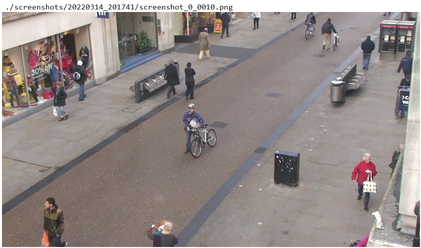
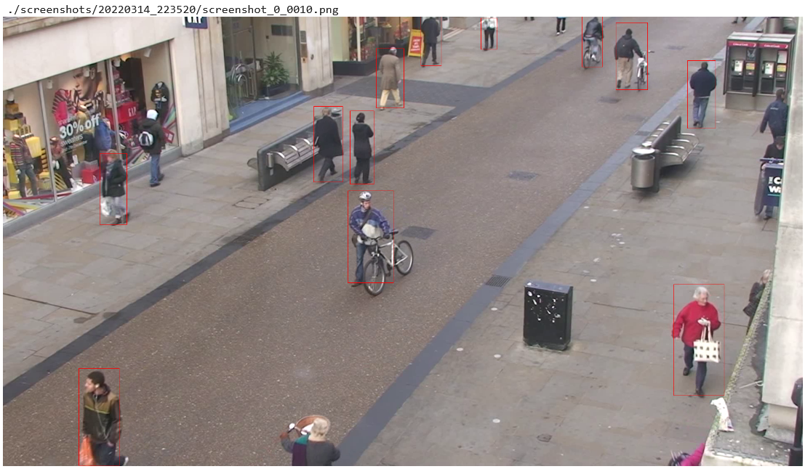
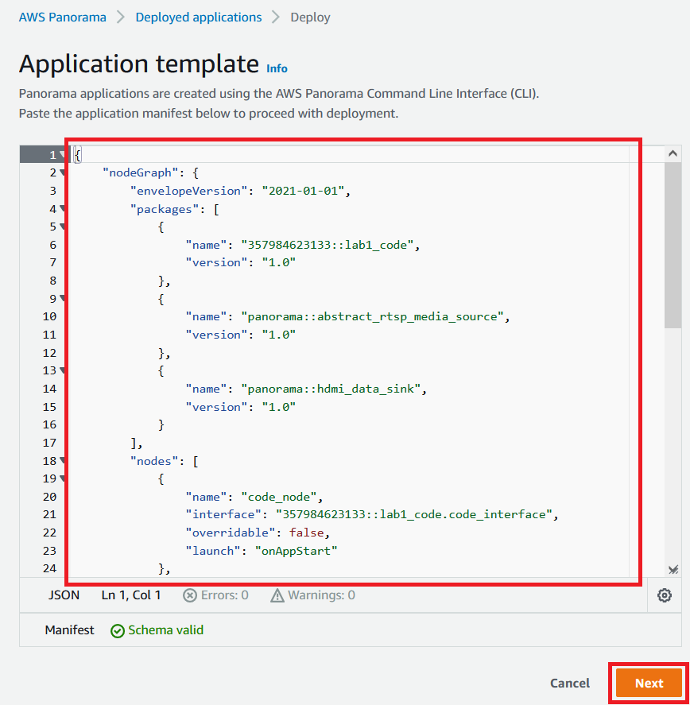
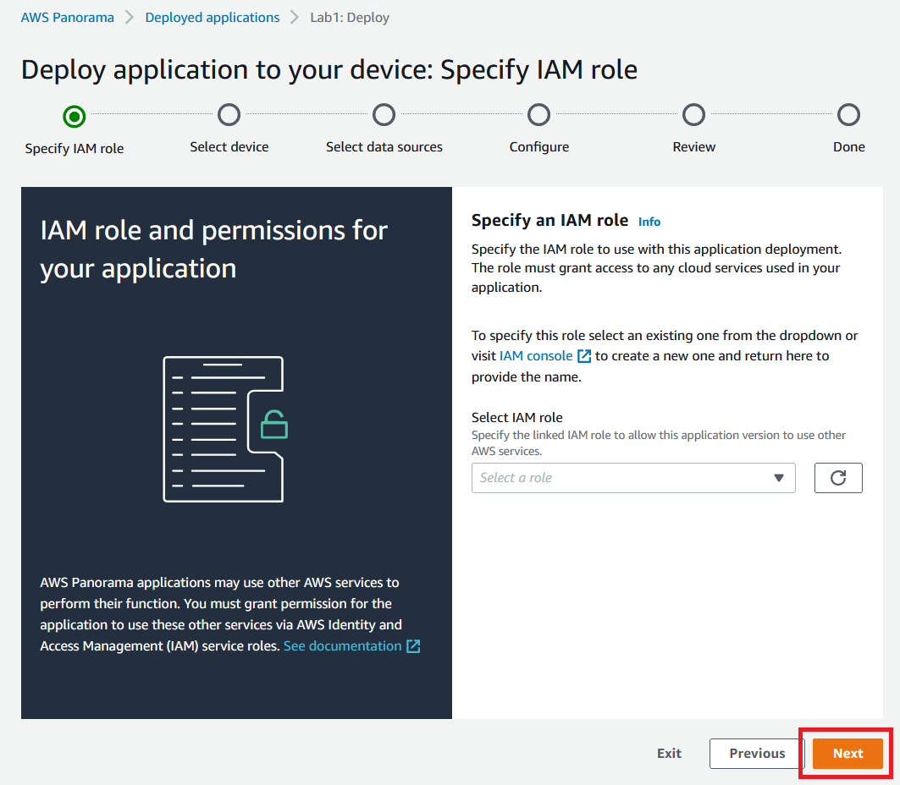
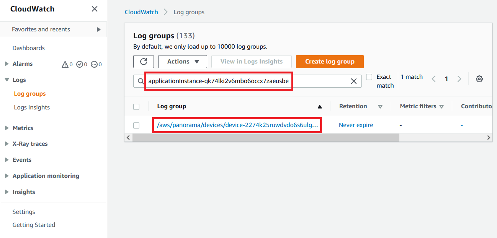
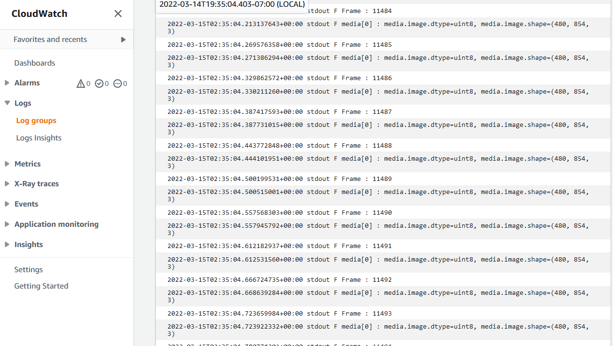
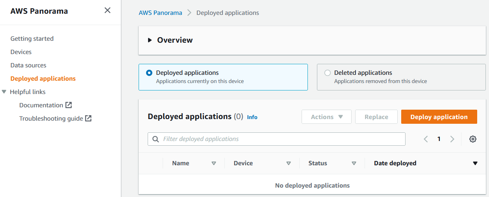

# Lab 1. Object detection

> **Warning:** Make sure you have performed the steps described in the Prerequisites section before beginning this lab.


## Overview

This Lab will walk you through step-by-step instructions on how to build AWS Panorama application, starting with "Hello World" application, then Video pass-through application, and finally People counter application. By completing this Lab, you will learn 1) how to create necessary components of Panorama application with panorama-cli command and text editor, 2) how to use panoramasdk module APIs, 3) how to run the application on notebooks or your local PC environment with Test Utility, and 4) how to deploy applications to real Panorama appliance devices.

**Test Utility** is a simulation environment for application developers. While it doesn't provide full compatibility with real hardware, it helps you develop Panorama application without real hardware, with quick development iteration time. For more details about the Test Utility, please refer to [this page](https://github.com/aws-samples/aws-panorama-samples/blob/main/docs/AboutTestUtility.md).

**panorama-cli** is a command-line utility to help Panorama application developers construct necessary components such as code node, model node, camera node, node packages, container image for code, and node graph structure. It also helps uploading packages to AWS Cloud before deploying application to the device. For more details about panorama-cli, please refer to [this page](https://github.com/aws/aws-panorama-cli).

## How to open and run notebook

This Lab uses SageMaker Notebook environment. 
1. Visit [SageMaker Notebooks instances page](https://console.aws.amazon.com/sagemaker/home#/notebook-instances) and find "PanoramaWorkshop". Click "Open JupyterLab". 
1. In the file browser pane in left hand side, locate "aws-panorama-immersion-day" >  "labs" > "1. Object detection.ipynb", and double click it. Notebook opens.
1. Select the first cell, and hit Shift-Enter key to execute a single selected cell and move to next cell.


## Preparation

1. Hit **Shift-Enter**, and execute the first code cell **"Import libraries"**. This cell imports necessarily Python modules for this Lab.
    ``` python
    # Import libraries

    import sys
    import os
    import json
    import glob
    import tarfile

    import boto3
    import sagemaker
    import IPython
    import gluoncv

    sys.path.insert( 0, os.path.abspath( "../common/test_utility" ) )
    import panorama_test_utility    
    ```

1. Execute next cell **Initialize variables and configurations**. This cell initializes some basic variables such as AWS account ID, region name, S3 bucket name, and SageMaker execution role ARN.

    ``` python
    # Initialize variables and configurations

    boto3_session = boto3.session.Session()
    sm_session = sagemaker.Session()

    account_id = boto3.client("sts").get_caller_identity()["Account"]
    region = boto3_session.region_name
    s3_bucket = sm_session.default_bucket()
    sm_role = sagemaker.get_execution_role()

    print( "account_id :", account_id )
    print( "region :", region )
    print( "s3_bucket :", s3_bucket )
    print( "sm_role :", sm_role )
    ```

## "Hello World!" application

In this Lab, as the first step, we create a simplest one-line application "Hello World!". Even for such simple application, Panorama application requires code package, Dockerfile, and manifest file. "panorama-cli" helps us create these files.

1. Run "panorama-cli init-project". This command creates a top directory ("lab1") for the application, 3 sub-directories ( "assets", "graphs", "packages" ), and empty graph.json file under "lab1/graphs/lab1/".

    ``` python
    app_name = "lab1"

    !panorama-cli init-project --name {app_name}
    ```

1. Run "panorama-cli create-package --type Container". This command creates a code package "lab1_code" under "lab1/packages/". 

    ``` python
    code_package_name = f"{app_name}_code"
    code_package_version = "1.0"

    !cd {app_name} && panorama-cli create-package --type Container --name {code_package_name} --version {code_package_version}
    ```

1. Manually create a one-line python source code.

    1. Using the file browser pane, browse to "./lab1/packages/{account_id}-lab1_code-1.0/src/". This directory is created by the previous step, but it is still empty.

    1. From the menu bar, select "File" > "New" > "Text File". A new empty text file "untitled.txt" is created.

    1. From the menu bar, select "File" > "Rename File". Rename the text file to "app.py".

    1. Edit the app.py with following single line of code, and save.

        ``` python
        print( "Hello World!", flush=True )
        ```

       > **Note:** On Panorama appliance devices, log outputs to sys.stdout / sys.stderr are automatically uploaded to CloudWatch Logs. But to make sure logs are uploaded immediately, flush() has to be called explicitly. Otherwise, logs are not uploaded until buffer becomes full. The argument flush=True indicates print() function calls flush() internally.

1. Manually edit the code node descriptor file, and specify the entry point of the application code.

    1. Using the file browser pane, browse to "./lab1/packages/{account_id}-lab1_code-1.0/". Find "descriptor.json".

    1. Right-click the file, and select "Open With" > "Editor", to open this file with text editor.

    1. Replace '<entry_file_name_under_src>' with 'app.py'. The modified version of file should look like this:

        ``` json
        {
            "runtimeDescriptor": {
                "envelopeVersion": "2021-01-01",
                "entry": {
                    "path": "python3",
                    "name": "/panorama/app.py"
                }
            }
        }
        ```
1. Build container image with "panorama-cli build-container" command.

    Building docker image and adding it to the code package as the asset. Test Utility doesn't use the container image itself, but it uses graph & package information to run.
    
    ```
    !cd {app_name} && panorama-cli build-container --container-asset-name code --package-path packages/{account_id}-{code_package_name}-{code_package_version}
    ```

    >This process takes some time (~ 5 min)

1. Run the Hello World application with "Test Utility".

    'panorama_test_utility_run.py' is the Test Utility "Run" script. You can use this python script either on notebook environment or on regular command-line terminal.

    ```
    %run ../common/test_utility/panorama_test_utility_run.py \
    \
    --app-name {app_name} \
    --code-package-name {code_package_name} \
    --py-file {source_filename}
    ```

    You should see console output in the output cell.

    ```
    Hello World!
    ```

## Video pass-through application

In this section, as the second step, we extend the application to "Video pass-through" application which receives video frames and just pass-through to HDMI output. You will learn how to create Camera node and DataSink node, how to connect those nodes with Code node, and how to run main loop by calling panoramasdk APIs.

> Note: On the Test Utility, camera input is simulated with static video file, and HDMI output is simulated by generating PNG files.

1. Create a camera node with "panorama-cli add-panorama-package --type camera" command.

    ```
    camera_node_name = f"{app_name}_camera"

    !cd {app_name} && panorama-cli add-panorama-package --type camera --name {camera_node_name}
    ```

1. Create a data sink (HDMI output) node with "panorama-cli add-panorama-package --type data_sink"

    ```
    data_sink_node_name = f"{app_name}_data_sink"

    !cd {app_name} && panorama-cli add-panorama-package --type data_sink --name {data_sink_node_name}
    ```

1. Manually edit the graph.json file, and connect code node, camera node, and data sink node.
    1. Open "lab1/graphs/lab1/graph.json" by text editor.
    1. Add edges to connect camera -> code, and code -> hdmi.

        ``` json
        "edges": [
            {
                "producer": "lab1_camera.video_out",
                "consumer": "code_node.video_in"
            },
            {
                "producer": "code_node.video_out",
                "consumer": "lab1_data_sink.video_in"
            }            
        ]
        ```

1. Manually edit the app.py, with following code.

    ``` python
    import panoramasdk

    # application class
    class Application(panoramasdk.node):
        
        # initialize application
        def __init__(self):
            
            super().__init__()
            
            self.frame_count = 0

        # run top-level loop of application  
        def run(self):
            
            while True:
                
                # get video frames from camera inputs 
                media_list = self.inputs.video_in.get()
                
                # print media object related information once
                if self.frame_count==0:
                    for i_media, media in enumerate(media_list):
                        print( f"media[{i_media}] : media.image.dtype={media.image.dtype}, media.image.shape={media.image.shape}", flush=True )

                # put video output to HDMI
                self.outputs.video_out.put(media_list)
                
                self.frame_count += 1

    app = Application()
    app.run()
    ```

    `panoramasdk` is the module which provides Panorama device side APIs. In this source code, application is defined as a "Application" class which derives `panoramasdk.node` class.

    `Application.run` is the method to run main-loop. In the main loop, it calls `node.inputs.video_in.get()` to get video frames from camera node, and `node.outputs.video_out.put()` to put video frames to data sink node. Please note that `video_in` and `video_out` are interface names defined in the `package.json` of the code package, and those interfaces are connected with camera node and data sink node by `edges` in `graph.json`.

    `video_in.get()` returns a list of `media` objects and each media object has `image` property (a numpy array) which represents a video frame from a camera. This application prints data type and data shape (image resolution and number of color elements) of the array.

1. Run the Video pass-through application with "Test Utility".

    We use the same panorama_test_utility_run.py script again, to run this application. Please note that we added some command line parameters in order to simulate camera input by video file, and HDMI output by generating screenshots.

    ```
    video_filepath = "../../videos/TownCentreXVID.avi"

    %run ../common/test_utility/panorama_test_utility_run.py \
    \
    --app-name {app_name} \
    --code-package-name {code_package_name} \
    --py-file {source_filename} \
    \
    --camera-node-name lab1_camera \
    --video-file {video_filepath} \
    --video-start 0 \
    --video-stop 10 \
    --video-step 1 \
    \
    --output-screenshots ./screenshots/%Y%m%d_%H%M%S
    ```

    Please confirm that you see following log in the output cell. The simulation should quickly finish because you specified `--video-stop 10`. This means simulation ends after 10 frames.

    ```
    Loading graph: ./lab1/graphs/lab1/graph.json
        :
        :
    media[0] : media.image.dtype=uint8, media.image.shape=(1080, 1920, 3)
    Reached end of video. Stopped simulation.
    ```

1. View the generated screenshot.

    As you specified `--output-screenshots` in the previous command, video frames passed to `node.outputs.video_out.put()` are written as sequencially numbered PNG files under the specified directory. Running following cell, you can render the latest screenshot file in the output cell.

    ``` python
    # View latest screenshot image

    latest_screenshot_dirname = sorted( glob.glob( "./screenshots/*" ) )[-1]
    screenshot_filename = sorted( glob.glob( f"{latest_screenshot_dirname}/*.png" ) )[-1]

    print(screenshot_filename)
    IPython.display.Image( filename = screenshot_filename )
    ```

    


## People detection application

In this section, we finally extend the application to "People detection" application which detect people in the video frames, and render bounding boxes on HDMI output. You will learn how to prepare pre-trained model by exporting from model zoo, how to create a Model node, how to compile the model for Test Utility, and how to call model inference process by calling panoramasdk API.

1. Export 'yolo3_mobilenet1.0_coco' from GluonCV's model zoo.

    This Lab uses pre-trained model exported from GluonCV's model zoo. Please run following cell to export 'yolo3_mobilenet1.0_coco'.

    ``` python
    def export_model_and_create_targz( prefix, name, model ):
        os.makedirs( prefix, exist_ok=True )
        gluoncv.utils.export_block( os.path.join( prefix, name ), model, preprocess=False, layout="CHW" )

        tar_gz_filename = f"{prefix}/{name}.tar.gz"
        with tarfile.open( tar_gz_filename, "w:gz" ) as tgz:
            tgz.add( f"{prefix}/{name}-symbol.json", f"{name}-symbol.json" )
            tgz.add( f"{prefix}/{name}-0000.params", f"{name}-0000.params" )
            
        print( f"Exported : {tar_gz_filename}" )
        
    # Export object detection model. Reset the classes for human detection only.
    people_detection_model = gluoncv.model_zoo.get_model('yolo3_mobilenet1.0_coco', pretrained=True)
    people_detection_model.reset_class(["person"], reuse_weights=['person'])
    export_model_and_create_targz( "models", "yolo3_mobilenet1.0_coco_person", people_detection_model )
    ```

    > Note: `reset_class()` used here in order to detect only people faster.

    Exported model data is saved under "models/" directory.
    About the pre-trained model more in detail, please see [this GluonCV page](https://cv.gluon.ai/model_zoo/detection.html).

1. Add exported model files in the model package with "panorama-cli create-package --type Model" command.

    ``` python
    model_package_name = f"{app_name}_model"
    model_package_version = "1.0"
    people_detection_model_name = "people_detection_model"

    !cd {app_name} && panorama-cli create-package --type Model --name {model_package_name} --version {model_package_version}
    ```

1. Manually edit the model descriptor file, and specify the name of ML framework ("MXNET"), input data name ("data") and input data shape ( [1, 3, 480, 600] ).

    1. Open "lab1/packages/{account_id}-lab1_model-1.0/descriptor.json" by text editor.
    1. Edit the contents as below:

        ``` python
        {
            "mlModelDescriptor": {
                "envelopeVersion": "2021-01-01",
                "framework": "MXNET",
                "inputs": [
                    {
                        "name": "data",
                        "shape": [ 1, 3, 480, 600 ]
                    }
                ]
            }
        }
        ```

1. Add the exported model data file and editted descriptor file with "panorama-cli add-raw-model" command.

    ``` python
    !cd {app_name} && panorama-cli add-raw-model \
        --model-asset-name {people_detection_model_name} \
        --model-local-path ../models/yolo3_mobilenet1.0_coco_person.tar.gz \
        --descriptor-path packages/{account_id}-{model_package_name}-{model_package_version}/descriptor.json \
        --packages-path packages/{account_id}-{model_package_name}-{model_package_version}
    ```

1. Compile the model  

    'panorama_test_utility_compile.py' is the Test Utility "Compile Model" script. You can use this python script either on notebook environment or on regular command-line terminal.

    > Note: This Model compilation is needed just for Test Utility. For real hardware, the model compilation is done automatically as a part of application deployment process. 

    ``` python
    people_detection_model_data_shape = '{"data":[1,3,480,600]}'

    %run ../common/test_utility/panorama_test_utility_compile.py \
    \
    --s3-model-location s3://{s3_bucket}/panorama-workshop/{app_name} \
    \
    --model-node-name {people_detection_model_name} \
    --model-file-basename ./models/yolo3_mobilenet1.0_coco_person \
    --model-data-shape '{people_detection_model_data_shape}' \
    --model-framework MXNET
    ```

1. Manually edit the app.py, with following code.

    ``` python
    import numpy as np
    import cv2

    import panoramasdk

    model_input_resolution = (600,480)        
    box_color = (0,0,255)
    box_thickness = 1

    # application class
    class Application(panoramasdk.node):
        
        # initialize application
        def __init__(self):
            
            super().__init__()
            
            self.frame_count = 0

        # run top-level loop of application  
        def run(self):
            
            while True:
                
                print( f"Frame : {self.frame_count}", flush=True )
                
                # get video frames from camera inputs 
                media_list = self.inputs.video_in.get()
                
                for i_media, media in enumerate(media_list):
                    print( f"media[{i_media}] : media.image.dtype={media.image.dtype}, media.image.shape={media.image.shape}", flush=True )

                    # pass the video frame, and get formatted data for model input
                    image_formatted = self.format_model_input(media.image)
                    
                    # pass the formatted model input data, run people detection, and get detected bounding boxes
                    detected_boxes = self.detect_people( image_formatted )
                    
                    # render the detected bounding boxes on the video frame
                    self.render_boxes( media.image, detected_boxes )
                    
                # put video output to HDMI
                self.outputs.video_out.put(media_list)
                
                self.frame_count += 1

        # convert video frame from camera to model input data
        def format_model_input( self, image ):
            
            # scale to resolution expected by the model
            image = cv2.resize( image, model_input_resolution )

            # uint8 -> float32
            image = image.astype(np.float32) / 255.0

            # [480,600,3] -> [1,3,480,600]
            B = image[:, :, 0]
            G = image[:, :, 1]
            R = image[:, :, 2]
            image = [[[], [], []]]
            image[0][0] = R
            image[0][1] = G
            image[0][2] = B
            
            return np.asarray(image)

        # run people detection, and return detected bounding boxes
        def detect_people( self, data ):
            
            detected_boxes = []
            
            model_node_name = "people_detection_model"
            score_threshold = 0.5
            klass_person = 0
            
            # call people detection model
            people_detection_results = self.call( {"data":data}, model_node_name )

            # None result means empty
            if people_detection_results is None:
                return detected_boxes
        
            classes, scores, boxes = people_detection_results

            assert classes.shape == (1,100,1)
            assert scores.shape == (1,100,1)
            assert boxes.shape == (1,100,4)
            
            # scale bounding box to 0.0 ~ 1.0 space
            def to_01_space( box ):
                return box / np.array([
                    model_input_resolution[0], 
                    model_input_resolution[1], 
                    model_input_resolution[0], 
                    model_input_resolution[1] 
                ])
            
            # gather bounding boxes to return
            for klass, score, box in zip( classes[0], scores[0], boxes[0] ):
                if klass[0] == klass_person:
                    if score[0] >= score_threshold:
                        box = to_01_space( box )
                        detected_boxes.append( box )

            return detected_boxes
        
        # render bounding boxes
        def render_boxes( self, image, boxes ):
            
            for box in boxes:
                
                # scale 0.0-1.0 space to camera image resolution
                h = image.shape[0]
                w = image.shape[1]
                box = (box * np.array([ w, h, w, h ])).astype(int)
                
                # render red rectancle
                cv2.rectangle( 
                    image, 
                    tuple(box[0:2]),
                    tuple(box[2:4]),
                    color = box_color,
                    thickness = box_thickness, 
                    lineType = cv2.LINE_8,
                )

    app = Application()
    app.run()
    ```

    In this version, we define 3 new methods `Application.format_model_input()`, `Application.detect_people()` and `Application.render_boxes()`. Also, in the main loop, we call these 3 new methods.

    ``` python
    # pass the video frame, and get formatted data for model input
    image_formatted = self.format_model_input(media.image)
    
    # pass the formatted model input data, run people detection, and get detected bounding boxes
    detected_boxes = self.detect_people( image_formatted )
    
    # render the detected bounding boxes on the video frame
    self.render_boxes( media.image, detected_boxes )
    ```

    Within the 3 new methods, `detect_people()` is the key. It calls `node.call()` API with the model node name and input data to run inference process, and returns the inference result.

    ``` python
    model_node_name = "people_detection_model"

    # call people detection model
    people_detection_results = self.call( {"data":data}, model_node_name )
    ```

    The data shape of the API result is model dependent. `yolo3_mobilenet1.0_coco` model returns a tuple of 3 Numpy arrays, `classes`, `scores` and `boxes`, and they contain up to 100 detected people.

    ``` python
    classes, scores, boxes = people_detection_results

    assert classes.shape == (1,100,1)
    assert scores.shape == (1,100,1)
    assert boxes.shape == (1,100,4)
    ```

    This method iterates the results and gather bounding boxes.

1. Run the People detection application with "Test Utility".

    We use the same panorama_test_utility_run.py script again, to run this application. Please note that we added some command line parameters in order to use model.

    ```
    video_filepath = "../../videos/TownCentreXVID.avi"

    %run ../common/test_utility/panorama_test_utility_run.py \
    \
    --app-name {app_name} \
    --code-package-name {code_package_name} \
    --py-file {source_filename} \
    \
    --model-package-name {model_package_name} \
    --model-node-name {people_detection_model_name} \
    --model-file-basename ./models/yolo3_mobilenet1.0_coco_person \
    \
    --camera-node-name lab1_camera \
    \
    --video-file {video_filepath} \
    --video-start 0 \
    --video-stop 10 \
    --video-step 1 \
    \
    --output-screenshots ./screenshots/%Y%m%d_%H%M%S
    ```

    Please confirm that you see following log in the output cell. The simulation should quickly finish because you specified `--video-stop 10`. This means simulation ends after 10 frames.

    ```
    Loading graph: ./lab1/graphs/lab1/graph.json
        :
        :
    Frame : 0
    media[0] : media.image.dtype=uint8, media.image.shape=(1080, 1920, 3)
    2022-03-14 22:35:22,234 INFO Found libdlr.so in model artifact. Using dlr from ./models/people_detection_model/yolo3_mobilenet1.0_coco_person-LINUX_X86_64/libdlr.so
    Frame : 1
    media[0] : media.image.dtype=uint8, media.image.shape=(1080, 1920, 3)
    Frame : 2
    media[0] : media.image.dtype=uint8, media.image.shape=(1080, 1920, 3)
        :
        :
    Frame : 10
    media[0] : media.image.dtype=uint8, media.image.shape=(1080, 1920, 3)
    Frame : 11
    Reached end of video. Stopped simulation.
    ```

1. View the generated screenshot.

    As same as last time, let's see generated screenshot. Please confirm that you see red bounding boxes on people in the image.

    ``` python
    # View latest screenshot image

    latest_screenshot_dirname = sorted( glob.glob( "./screenshots/*" ) )[-1]
    screenshot_filename = sorted( glob.glob( f"{latest_screenshot_dirname}/*.png" ) )[-1]

    print(screenshot_filename)
    IPython.display.Image( filename = screenshot_filename )
    ```

    


## Run the people detection application on real device

> Note: This section is only for people who provisioned a Panorama appliance device with the AWS account. If you don't have, please skip to "Conclusion".

In this Lab so far, we used Test Utility to run applications. While it is useful For who want to run applications without real hardware, and for who want to iterate development faster, it doesn't provide full compatibility and there are [known limitations](https://github.com/aws-samples/aws-panorama-samples/blob/main/docs/AboutTestUtility.md). Especially, real hardware is essential in order to understand the actual performance.

In this section, we deploy the application onto real hardware, see the result on HDMI display and CloudWatch Logs, and delete the application.

1. Confirm the Panorama applaince device is correctly provisioned with this AWS account. 

    ```
    !aws panorama list-devices
    ```

    Following is an example output.

    ```
    {
        "Devices": [
            {
                "CreatedTime": 1646850480.295,
                "DeviceId": "device-**************************",
                "LastUpdatedTime": 1647033459.323,
                "LeaseExpirationTime": 1647465427.0,
                "Name": "MyDevice1",
                "ProvisioningStatus": "SUCCEEDED"
            }
        ]
    }
    ```

1. Manually edit the Docker file, and add some python libraries.

    1. Open ./lab1/packages/{account_id}-lab1_code-1.0/Dockerfile with text editor.
    1. Add "pip3 install" command at the end of the Dockerfile, to install `opencv-python` and `boto3`.

        ```
        FROM public.ecr.aws/panorama/panorama-application
        COPY src /panorama
        RUN pip3 install opencv-python boto3
        ```

1. Build the business logic container again with latest source code.

    Building container image is not needed when you use Test Utility, but for real hardware, you need to build the container image when you update the source code.

    ```
    !cd {app_name} && panorama-cli build-container --container-asset-name code --package-path packages/{account_id}-{code_package_name}-{code_package_version}
    ```

1. Upload locally prepared packages onto Cloud with "panorama-cli package-application" command.

    `panorama-cli package-application` command creates packages, register versions, and upload assets (container image, model data), based on the information we prepared locally. This process takes some time depending on the network bandwidth.

    ```
    !cd {app_name} && panorama-cli package-application
    ```

1. Deploy the application using the AWS Management Console.

    > Note: You can deploy applications using API/CLI as well. For more details, please see the Lab2.

    1. Open https://console.aws.amazon.com/panorama/home#deployed-applications, and click "Deploy aplication" button.
        
        

    1. "Copy your application manifest" dialog appears. Open "./lab1/graphs/lab1/graph.json" with Text editor, and copy the contents to the clipboard, and click "Ok" button.

        

    1. Paste the contents of graph.json, and click "Next" button.

        

    1. Input application name "Lab1", and click "Proceed to deploy" button.

        

    1. "Panorama pricing" dialog appears. This is a confirmation how cost for AWS Panorama is charged. Click "Continue" button.

        

    1. Click "Begin deployment" button.

        

    1. IAM Role can be empty for this application. Click "Next" button.

        

    1. Click "Select device" button.

        

    1. Choose your device, and click "Select" button.

        

    1. Confirm the selected device, and click "Next" button.

        

    1. Confirm the selected device, and click "Next" button.

        

    1. Click "View input(s)" button.

        

    1. Click "Select data sources" button.

        

    1. Select the data source, and click "Save" button.

        

    1. Confirm the selected data source, and click "Save" button.

        

    1. Click "Next" button.

        

    1. Click "Next" button.

        

    1. Click "Deploy" button.

        

    1. Deployment process starts. Click "Done" button.

        

    1. You can monitor the deployment status on the application list screen.

        

    1. Wait until the status changes to "Running".

        

1. Check HDMI output (If HDMI display is available)

    1. Connect your HDMI display with the Panorama appliance device.
    1. Confirm that camera image and bounding boxes are visible on the display.

1. Check application logs on CloudWatch Logs

    1. Open https://console.aws.amazon.com/panorama/home#deployed-applications, and click the deployed application.

        

    1. Copy the application instance ID to the clipboard.

        

    1. Open https://console.aws.amazon.com/cloudwatch/home#logsV2:log-groups, and search for a log group which contains the application instance ID. Click it.

        
    
    1. Find a log stream "console_output", click it.

        

    1. Confirm logs from application are visible.

        

1. Delete the application.

    Once you confirmed that the application is running as expected, let's delete the application before moving to next Labs.

    1. Open https://console.aws.amazon.com/panorama/home#deployed-applications, and select the application.

        

    1. From the "Actions" drop-down menu, choose "Delete from device".

        

    1. Input the application name "Lab1", and click "Delete".

        

    1. Application status changes to "Deleting".

        

    1. Wait until the application disappears from the list.

        

## Conclusion

By completing this Lab, you learned how to build basic AWS Panorama application step-by-step.

> **Note:** Before proceeding to the next lab, please select "Kernel" > "Shut Down Kernel" from the menu bar to shut down the Jupyter kernel for this notebook, and free up memory.
