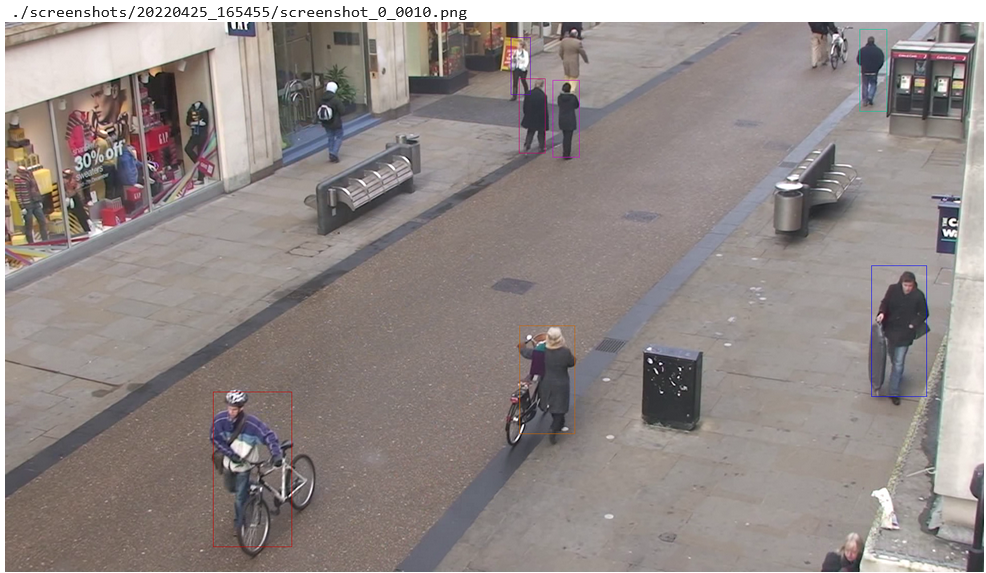
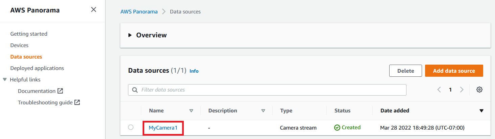
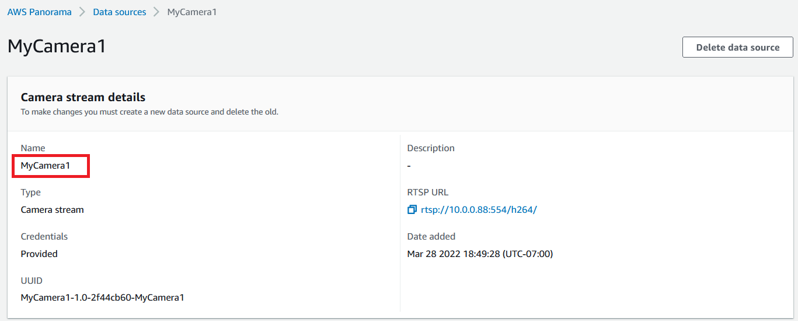

# Lab 2. Object tracking

> **Warning:** Make sure you have performed the steps described in the Prerequisites section before beginning this lab.

## Overview

This Lab will walk you through step-by-step instructions on how to build AWS Panorama application, starting with importing existing People detection application, and extending it to People tracking application. By completing this Lab, you will learn 1) how to import existing application to start quickly, 2) how to extend the object detection application to object tracking application by customizing the application code, 3) how to run the application on notebooks or your local PC environment with Test Utility, and 4) how to deploy applications to real Panorama appliance devices programatically.

The previous Lab-1 covers how to create an Object detection application from scratch, in more step-by-step manner. While completing Lab-1 is not a strong requirement before this Lab, it is recommended to finish Lab-1 first to understand the basics.

**Test Utility** is a simulation environment for application developers. While it doesn't provide full compatibility with real hardware, it helps you develop Panorama application without real hardware, with quick development iteration time. For more details about the Test Utility, please refer to [this page](https://github.com/aws-samples/aws-panorama-samples/blob/main/docs/AboutTestUtility.md).

**panorama-cli** is a command-line utility to help Panorama application developers construct necessary components such as code node, model node, camera node, node packages, container image for code, and node graph structure. It also helps uploading packages to AWS Cloud before deploying application to the device. For more details about panorama-cli, please refer to [this page](https://github.com/aws/aws-panorama-cli).


## How to open and run notebook

This Lab uses SageMaker Notebook environment. 
1. Visit [SageMaker Notebooks instances page](https://console.aws.amazon.com/sagemaker/home#/notebook-instances) and find "PanoramaWorkshop". Click "Open JupyterLab". 
1. In the file browser pane in left hand side, locate "aws-panorama-immersion-day" >  "labs" > "2. Object tracking.ipynb", and double click it. Notebook opens.
1. Select the first cell, and hit Shift-Enter key to execute a single selected cell and move to next cell.


## Preparation

1. Hit **Shift-Enter**, and execute the first code cell **"Import libraries"**. This cell imports necessarily Python modules for this Lab.
    ``` python
    # Import libraries

    import sys
    import os
    import time
    import json
    import glob
    import tarfile

    import boto3
    import sagemaker
    import IPython
    import gluoncv

    sys.path.insert( 0, os.path.abspath( "../common/test_utility" ) )
    import panorama_test_utility
    ```

1. Execute next cell **Initialize variables and configurations**. This cell initializes some basic variables such as AWS account ID, region name, S3 bucket name, and SageMaker execution role ARN.

    ``` python
    # Initialize variables and configurations

    boto3_session = boto3.session.Session()
    sm_session = sagemaker.Session()

    account_id = boto3.client("sts").get_caller_identity()["Account"]
    region = boto3_session.region_name
    s3_bucket = sm_session.default_bucket()
    sm_role = sagemaker.get_execution_role()

    print( "account_id :", account_id )
    print( "region :", region )
    print( "s3_bucket :", s3_bucket )
    print( "sm_role :", sm_role )
    ```

## Start with "People detection" application

In this Lab, we start with importing existing People detection application. You can find existing application project files under `lab2/` directory.

1. Run "panorama-cli import-application". This command essentially replaces placeholder account-IDs in the directory names and JSON file contents, with your AWS account-ID.

    ``` python
    app_name = "lab2"

    !cd {app_name} && panorama-cli import-application
    ```

1. Let's preview the source code of application. Because we imported existing application, we already have the source code.

    ``` python
    code_package_name = f"{app_name}_code"
    code_package_version = "1.0"
    source_filename = f"./lab2/packages/{account_id}-{code_package_name}-{code_package_version}/src/app.py"

    panorama_test_utility.preview_text_file(source_filename)
    ```

1. Export 'yolo3_mobilenet1.0_coco' from GluonCV's model zoo.

    This Lab uses pre-trained model exported from GluonCV's model zoo. Please run following cell to export 'yolo3_mobilenet1.0_coco'.

    ``` python
    def export_model_and_create_targz( prefix, name, model ):
        os.makedirs( prefix, exist_ok=True )
        gluoncv.utils.export_block( os.path.join( prefix, name ), model, preprocess=False, layout="CHW" )

        tar_gz_filename = f"{prefix}/{name}.tar.gz"
        with tarfile.open( tar_gz_filename, "w:gz" ) as tgz:
            tgz.add( f"{prefix}/{name}-symbol.json", f"{name}-symbol.json" )
            tgz.add( f"{prefix}/{name}-0000.params", f"{name}-0000.params" )
            
        print( f"Exported : {tar_gz_filename}" )
        
    # Export object detection model. Reset the classes for human detection only.
    people_detection_model = gluoncv.model_zoo.get_model('yolo3_mobilenet1.0_coco', pretrained=True)
    people_detection_model.reset_class(["person"], reuse_weights=['person'])
    export_model_and_create_targz( "models", "yolo3_mobilenet1.0_coco_person", people_detection_model )
    ```

    > Note: `reset_class()` used here in order to detect only people faster.

    Exported model data is saved under "models/" directory.
    About the pre-trained model more in detail, please see [this GluonCV page](https://cv.gluon.ai/model_zoo/detection.html).

1. Add the exported model data file and model descriptor file with "panorama-cli add-raw-model" command.

    We can use existing model descriptor file as-is. You can find it here `./lab2/packages/{account-id}-lab2_model-1.0/descriptor.json`. In this file, ML framework is specified as "MXNET", input data name as "data" and input data shape as [1, 3, 480, 600].

    ``` python
    model_package_name = f"{app_name}_model"
    model_package_version = "1.0"
    people_detection_model_name = "people_detection_model"

    !cd {app_name} && panorama-cli add-raw-model \
        --model-asset-name {people_detection_model_name} \
        --model-local-path ../models/yolo3_mobilenet1.0_coco_person.tar.gz \
        --descriptor-path packages/{account_id}-{model_package_name}-{model_package_version}/descriptor.json \
        --packages-path packages/{account_id}-{model_package_name}-{model_package_version}
    ```

1. Compile the model  

    'panorama_test_utility_compile.py' is the Test Utility "Compile Model" script. You can use this python script either on notebook environment or on regular command-line terminal.

    > Note: This Model compilation is needed just for Test Utility. For real hardware, the model compilation is done automatically as a part of application deployment process. 

    ``` python
    people_detection_model_data_shape = '{"data":[1,3,480,600]}'

    %run ../common/test_utility/panorama_test_utility_compile.py \
    \
    --s3-model-location s3://{s3_bucket}/panorama-workshop/{app_name} \
    \
    --model-node-name {people_detection_model_name} \
    --model-file-basename ./models/yolo3_mobilenet1.0_coco_person \
    --model-data-shape '{people_detection_model_data_shape}' \
    --model-framework MXNET
    ```

1. Run the People detection application with "Test Utility".

    ``` python
    video_filepath = "../../videos/TownCentreXVID.avi"

    %run ../common/test_utility/panorama_test_utility_run.py \
    \
    --app-name {app_name} \
    --code-package-name {code_package_name} \
    --py-file {source_filename} \
    \
    --model-package-name {model_package_name} \
    --model-node-name {people_detection_model_name} \
    --model-file-basename ./models/yolo3_mobilenet1.0_coco_person \
    \
    --camera-node-name lab2_camera \
    \
    --video-file {video_filepath} \
    --video-start 0 \
    --video-stop 100 \
    --video-step 10 \
    \
    --output-screenshots ./screenshots/%Y%m%d_%H%M%S
    ```

    Please confirm that you see following log in the output cell. The simulation should quickly finish because you specified `--video-stop 10`. This means simulation ends after 10 frames.

    ```
    Loading graph: ./lab2/graphs/lab2/graph.json
        :
        :
    Frame : 0
    media[0] : media.image.dtype=uint8, media.image.shape=(1080, 1920, 3)
    2022-03-14 22:35:22,234 INFO Found libdlr.so in model artifact. Using dlr from ./models/people_detection_model/yolo3_mobilenet1.0_coco_person-LINUX_X86_64/libdlr.so
    Frame : 1
    media[0] : media.image.dtype=uint8, media.image.shape=(1080, 1920, 3)
    Frame : 2
    media[0] : media.image.dtype=uint8, media.image.shape=(1080, 1920, 3)
        :
        :
    Frame : 10
    media[0] : media.image.dtype=uint8, media.image.shape=(1080, 1920, 3)
    Frame : 11
    Reached end of video. Stopped simulation.
    ```

1. View the generated screenshot.

    As you specified `--output-screenshots` in the previous command, video frames passed to `node.outputs.video_out.put()` are written as sequencially numbered PNG files under the specified directory. Running following cell, you can render the latest screenshot file in the output cell.

    ``` python
    # View latest screenshot image

    latest_screenshot_dirname = sorted( glob.glob( "./screenshots/*" ) )[-1]
    screenshot_filename = sorted( glob.glob( f"{latest_screenshot_dirname}/*.png" ) )[-1]

    print(screenshot_filename)
    IPython.display.Image( filename = screenshot_filename )    
    ```

    > FIXME : replace with different video / screenshot which demonstrate the object tracking capability
    


## Extend to "People tracking" application

In this section, we will extend the People detection application to People tracking application. To track people in camera streams, we use bounding boxes of detected people. As people move as time goes, bounding boxes also move. To track those moving bounding boxes, we use `SimpleObjectTracker` class which is a simple pure-python implementation of object tracking based on bounding boxes.

1. Create a new python source file `simple_object_tracker.py` and define `SimpleObjectTracker` class in it.

    1. Using the file browser pane, browse to "./lab2/packages/{account_id}-lab2_code-1.0/src/". You should see `app.py` already.

    1. From the menu bar, select "File" > "New" > "Text File". A new empty text file "untitled.txt" is created.

    1. From the menu bar, select "File" > "Rename File". Rename the text file to "simple_object_tracker.py".

    1. Edit the simple_object_tracker.py with code, and save.

        ``` python
        import math
        import uuid

        # A class which represents a tracked object
        class TrackedObject:
            
            def __init__( self, box, forget_timer ):
                self.box = box
                self.forget_timer = forget_timer
                self.mapped = False
                self.uuid = uuid.uuid4()

        # A class to track multiple objects using moving bounding boxes
        class SimpleObjectTracker:
            
            def __init__( self, tick_count_before_forget = 30 ):
                self.objs = []
                self.tick_count_before_forget = tick_count_before_forget
            
            # track objects for bounding boxes and return a list of TrackedObject corresponding to passed boxes
            def track( self, boxes ):
                
                mapped_objects = []
                
                # mark all objects unmapped
                for o in self.objs:
                    o.mapped = False
                
                # for each bounding box, check all tracked objects and choose best fit one
                for b in boxes:
                    
                    found = None
                    closest_distance2 = math.inf
                
                    for o in self.objs:
                        
                        # skip if this object is already mapped to other box
                        if o.mapped:
                            continue
                        
                        # skip if there is no intersection intersection
                        if (b[2] < o.box[0] or # left
                            b[0] > o.box[2] or # right
                            b[3] < o.box[1] or # above
                            b[1] > o.box[3]):  # below
                            continue

                        # choose closest object being tracked, using distances of top-left, bottom-right corners
                        distance2 = ((b-o.box)**2).sum()
                        if distance2 < closest_distance2:
                            found = o
                            closest_distance2 = distance2
                    
                    # if it seems the object is not being tracked, create new one
                    if found is None:                
                        found = TrackedObject( b, self.tick_count_before_forget )
                        self.objs.append(found)
                    
                    # update the tracked object
                    found.mapped = True
                    found.box = b
                    found.forget_timer = self.tick_count_before_forget

                    # add the found one in the result
                    mapped_objects.append(found)

                # count down forget timer of objects
                for o in self.objs:
                    o.forget_timer -= 1

                # forget objects
                self.objs = list( filter( lambda o: o.forget_timer > 0, self.objs) )
                
                assert len(mapped_objects) == len(boxes)
                
                return mapped_objects
        ```

        This `SimpleObjectTracker` class internally creates and maintains a list of `TrackedObject` to track objects. When `track()` is called with updated bounding boxes, it does following processes.
        
        1. For each new bounding box, iterate over the list of existing `TrackedObject` objects to find the closest TrackedObject which intersects the new bounding box, and has the shortest distance to the new bounding box with respect to the top-left and bottom-right corners.

        1. When there is no existing `TrackedObject` which intersects new bounding box, create new one.

        1. When TrackedObject is not mapped to new bounding boxes for a certain period (30 frames by default), consider it disappeared and remove it from the list.


1. Manually edit the app.py to use the SimpleObjectTracker class

    ``` python
    import numpy as np
    import cv2

    import panoramasdk

    import simple_object_tracker

    model_input_resolution = (600,480)
    box_thickness = 1

    # application class
    class Application(panoramasdk.node):
        
        # initialize application
        def __init__(self):
            
            super().__init__()
            
            self.frame_count = 0
            
            # create a object tracker
            self.tracker = simple_object_tracker.SimpleObjectTracker()

        # run top-level loop of application  
        def run(self):
            
            while True:
                
                print( f"Frame : {self.frame_count}", flush=True )
                
                # get video frames from camera inputs 
                media_list = self.inputs.video_in.get()
                
                for i_media, media in enumerate(media_list):
                    print( f"media[{i_media}] : media.image.dtype={media.image.dtype}, media.image.shape={media.image.shape}", flush=True )

                    # pass the video frame, and get formatted data for model input
                    image_formatted = self.format_model_input(media.image)
                    #print( f"image_formatted : image_formatted.dtype={image_formatted.dtype}, image_formatted.shape={image_formatted.shape}", flush=True )
                    
                    # pass the formatted model input data, run people detection, and get detected bounding boxes
                    detected_boxes = self.detect_people( image_formatted )
                    #print( f"detected_boxes : len(detected_boxes)={len(detected_boxes)}, detected_boxes={detected_boxes}", flush=True )
                    
                    # pass the bounding boxes and track objects
                    mapped_objects = self.track_people(detected_boxes)
                    #print( f"mapped_objects : {mapped_objects}", flush=True )
                    
                    # render the detected bounding boxes on the video frame
                    self.render_boxes( media.image, detected_boxes, mapped_objects )
                    
                # put video output to HDMI
                self.outputs.video_out.put(media_list)
                
                self.frame_count += 1

        # convert video frame from camera to model input data
        def format_model_input( self, image ):
            
            # scale to resolution expected by the model
            image = cv2.resize( image, model_input_resolution )

            # uint8 -> float32
            image = image.astype(np.float32) / 255.0

            # [480,600,3] -> [1,3,480,600]
            B = image[:, :, 0]
            G = image[:, :, 1]
            R = image[:, :, 2]
            image = [[[], [], []]]
            image[0][0] = R
            image[0][1] = G
            image[0][2] = B
            
            return np.asarray(image)

        # run people detection, and return detected bounding boxes
        def detect_people( self, data ):
            
            detected_boxes = []
            
            model_node_name = "people_detection_model"
            score_threshold = 0.5
            klass_person = 0
            
            # call people detection model
            people_detection_results = self.call( {"data":data}, model_node_name )
            
            # None result means empty
            if people_detection_results is None:
                return detected_boxes
            
            classes, scores, boxes = people_detection_results

            assert classes.shape == (1,100,1)
            assert scores.shape == (1,100,1)
            assert boxes.shape == (1,100,4)
            
            # scale bounding box to 0.0 ~ 1.0 space
            def to_01_space( box ):
                return box / np.array([
                    model_input_resolution[0], 
                    model_input_resolution[1], 
                    model_input_resolution[0], 
                    model_input_resolution[1] 
                ])
            
            # gather bounding boxes to return
            for klass, score, box in zip( classes[0], scores[0], boxes[0] ):
                if klass[0] == klass_person:
                    if score[0] >= score_threshold:
                        box = to_01_space( box )
                        detected_boxes.append( box )

            return detected_boxes
        
        # track people
        def track_people( self, boxes ):
            
            mapped_objects = self.tracker.track(boxes)
            return mapped_objects
        
        # render bounding boxes
        def render_boxes( self, image, boxes, mapped_objects ):
            
            for box, obj in zip( boxes, mapped_objects ):
                
                colors = [
                    (255,   0,   0),
                    (153,  76,   0),
                    (153, 204,   0),
                    (  0, 204,   0),
                    (  0, 102, 204),
                    (  0,   0, 204),
                    (  0,   0, 102),
                    (102,   0, 204),
                    (204,   0, 204),
                    (204,   0, 102),
                    (255,   0,   0),
                    (153,  76,   0),
                    (153, 204,   0),
                    (  0, 204,   0),
                    (  0, 102, 204),
                    (  0,   0, 204),
                    (  0,   0, 102),
                    (102,   0, 204),
                    (204,   0, 204),
                    (204,   0, 102),
                ]
                
                box_color = colors[ int(obj.uuid) % len(colors) ]
                
                # scale 0.0-1.0 space to camera image resolution
                h = image.shape[0]
                w = image.shape[1]
                box = (box * np.array([ w, h, w, h ])).astype(int)
                
                # render red rectancle
                cv2.rectangle( 
                    image, 
                    tuple(box[0:2]),
                    tuple(box[2:4]),
                    color = box_color,
                    thickness = box_thickness, 
                    lineType = cv2.LINE_8,
                )

    app = Application()
    app.run()
    ```

    Let's check what are changed from previous version of app.py. Firstly we import simple_object_tracker which defines SimpleObjectTracker.

    ``` python
    import simple_object_tracker
    ```

    In the constructor of Application class, we create an instance of SimpleObjectTracker class.

    ``` python
    # create a object tracker
    self.tracker = simple_object_tracker.SimpleObjectTracker()
    ```

    In the main loop, after calling `Application.detect_people()`, we call `Application.track_people()`, with detected bounding boxes. It is essentially a thin wrapper of `SimpleObjectTracker.track()`.

    ``` python
    # pass the bounding boxes and track objects
    mapped_objects = self.track_people(detected_boxes)
    ```

    ``` python
    # track people
    def track_people( self, boxes ):
        mapped_objects = self.tracker.track(boxes)
        return mapped_objects
    ```

    In the `Application.render_boxes()`, we added an argument `mapped_objects` which is a list of `TrackedObject`. Using `TrackedObject.uuid` property, we render bounding boxes in different colors, so that we can make sure object tracking is working as expected.

    ``` python
    # render bounding boxes
    def render_boxes( self, image, boxes, mapped_objects ):
        :
    ```

1. Run the People tracking application with "Test Utility".

    We use the same panorama_test_utility_run.py script again, to run this application. Command line arguments are exactly same as previous time.

    ``` python
    video_filepath = "../../videos/TownCentreXVID.avi"

    %run ../common/test_utility/panorama_test_utility_run.py \
    \
    --app-name {app_name} \
    --code-package-name {code_package_name} \
    --py-file {source_filename} \
    \
    --model-package-name {model_package_name} \
    --model-node-name {people_detection_model_name} \
    --model-file-basename ./models/yolo3_mobilenet1.0_coco_person \
    \
    --camera-node-name lab2_camera \
    \
    --video-file {video_filepath} \
    --video-start 0 \
    --video-stop 10 \
    --video-step 1 \
    \
    --output-screenshots ./screenshots/%Y%m%d_%H%M%S
    ```

1. View the generated screenshots.

    As same as last time, let's see generated screenshot. Please confirm that you see bounding boxes in multiple colors. You can open different screenshot files in the same directory to confirm that the application used same color for same object across multple frames.

    ``` python
    # View 1st and last frame image with Object Tracking
    latest_screenshot_dirname = sorted( glob.glob( "./screenshots/*" ) )[-1]

    # This is the 1st frame 
    screenshot_filename = sorted( glob.glob( f"{latest_screenshot_dirname}/*.png" ) )[0]
    print(screenshot_filename)
    IPython.display.Image( filename = screenshot_filename )
    ```

    ``` python
    # This is the 10th frame 
    screenshot_filename = sorted( glob.glob( f"{latest_screenshot_dirname}/*.png" ) )[-1]
    print(screenshot_filename)
    IPython.display.Image( filename = screenshot_filename )
    ```

    
    


## Run the people tracking application on real device

> Note: This section is only for people who provisioned a Panorama appliance device with the AWS account. If you don't have, please skip to "Conclusion".

In this Lab so far, we used Test Utility to run applications. While it is useful For who want to run applications without real hardware, and for who want to iterate development faster, it doesn't provide full compatibility and there are [known limitations](https://github.com/aws-samples/aws-panorama-samples/blob/main/docs/AboutTestUtility.md). Especially, real hardware is essential in order to understand the actual performance.

In this section, we deploy the application onto real hardware, see the result on HDMI display and CloudWatch Logs, and delete the application. In this Lab, we deploy the application **programmatically** using `boto3`'s `panorama` client. If you want to understand how to deploy via browser UI, please refer to the previous Lab - Object detection.

1. Create a boto3's panorama client. This is the interface to hit Panorama service APIs from Python (the notebook environment in this case).

    ``` python
    panorama_client = boto3.client("panorama")
    ```

1. Using the created panorama client, call `list_devices()` API, and check if there is a successfully provisioned device in the AWS account. The device ID is stored in the `device_id` variable.

    ``` python
    response = panorama_client.list_devices()
    for device in response["Devices"]:
        if device["ProvisioningStatus"]=="SUCCEEDED":
            break
    else:
        assert False, "Provisioned device not found."

    device_id = device["DeviceId"]

    print( "%s : %s" % (device["Name"], device["DeviceId"]) )
    ```

1. Build the business logic container.

    Building container image is not needed when you use Test Utility, but for real hardware, you need to build the container image when you update the source code.

    ``` python
    !cd {app_name} && panorama-cli build-container --container-asset-name code --package-path packages/{account_id}-{code_package_name}-{code_package_version}
    ```

1. Upload locally prepared packages onto Cloud with "panorama-cli package-application" command.

    `panorama-cli package-application` command creates packages, register versions, and upload assets (container image, model data), based on the information we prepared locally. This process takes some time depending on the network bandwidth.

    ``` python
    !cd {app_name} && panorama-cli package-application
    ```

1. Look up data source name on the Management Console UI.

    1. Open https://console.aws.amazon.com/panorama/home#data-sources, and confirm there is a data source you want to use in this Lab. click it.

        

    1. Copy the name of the data source into your clipboard.

        

1. Define actual data source in the override manifest file.

    1. Understand why override manifest file is needed.

        Before editting override manifest file, let's check the main manifest file `graph.json`, and understand why override manifest file is needed here.

        The manifest file and override manifest file are located under `./lab2/graphs/lab2`. If you open the graph.json, you should see following two elements in it.

        ``` json
        "packages": [
                :
            {
                "name": "panorama::abstract_rtsp_media_source",
                "version": "1.0"
            },
                :
        ],
        ```

        ``` json
        "nodes": [
                :
            {
                "name": "lab2_camera",
                "interface": "panorama::abstract_rtsp_media_source.rtsp_v1_interface",
                "overridable": true,
                "launch": "onAppStart",
                "decorator": {
                    "title": "Camera lab2_camera",
                    "description": "Default description for camera lab2_camera"
                }
            },
                :
        ]
        ```

        The main manifest file contains a Camera node `lab2_camera`. But as it uses `panorama::abstract_rtsp_media_source.rtsp_v1_interface` interface, it is not associated with any actual data sources. You need to replace this abstract data source node with actual data sources by providing override manifest file. This abstract structure is useful when you want to maintain a single graph.json and use different sets of cameras on different devices.

    1. Manually edit the override manifest file.

        In order to replace the abstract camera node, please edit the `override.json` referring to following example.

        ``` json
        {
            "nodeGraphOverrides": {
                "envelopeVersion": "2021-01-01",
                "packages": [
                    {
                        "name": "{YourAwsAccountId}::{YourCameraName}",
                        "version": "1.0"
                    }
                ],
                "nodes": [
                    {
                        "name": "{YourCameraName}_node",
                        "interface": "{YourAwsAccountId}::{YourCameraName}.{YourCameraName}",
                        "overridable": true,
                        "overrideMandatory" : false,
                        "launch" : "onAppStart"
                    }
                ],
                "nodeOverrides": [
                    {
                        "replace": "lab2_camera",
                        "with": [
                            {
                                "name": "{YourCameraName}_node"
                            }
                        ]
                    }
                ]
            }
        }
        ```

        This example contains placeholders `{YourAwsAccountId}` and `{YourCameraName}` in multiple places. Please carefully replace all the placeholders with AWS account ID you are using for this Lab, and the data source name you just found on the Management Console UI. 
        
        > Note: Please replace including `{` and `}` characters. For example, if the account id is 123456789012, and if your data source name is MyCamera1, the replaced package name should look like "123456789012::MyCamera1".

        > Note: In this Lab, we use just one data source, but it is possible to replace the abstract camera node with **multiple data sources**.

        And save the file.

1. Make sure your device is Online by running following cell.

    ``` python
    response = panorama_client.describe_device( DeviceId = device_id )
    eth0_status = response["CurrentNetworkingStatus"]["Ethernet0Status"]["ConnectionStatus"]
    eth1_status = response["CurrentNetworkingStatus"]["Ethernet1Status"]["ConnectionStatus"]

    print( "eth0 :", eth0_status)
    print( "eth1 :", eth1_status)

    assert eth0_status=="CONNECTED" or eth1_status=="CONNECTED"    
    ```

1. Deploy an application instance by calling `create_application_instance()`

    ``` python
    def get_escaped_payload_from_json(filename):
        with open(filename) as fd:
            return json.dumps(json.loads(fd.read()))

    manifest_payload = get_escaped_payload_from_json( f"./{app_name}/graphs/{app_name}/graph.json" )
    override_payload = get_escaped_payload_from_json( f"./{app_name}/graphs/{app_name}/override.json" )

    response = panorama_client.create_application_instance(
        Name = app_name,
        DefaultRuntimeContextDevice = device_id,
        ManifestPayload = {"PayloadData":manifest_payload},
        ManifestOverridesPayload = {"PayloadData":override_payload},
    )

    application_instance_id = response["ApplicationInstanceId"]

    response
    ```

1. Wait until the deployment completes by calling `describe_application_instance()`

    Deployment takes time. Let's run following cell to monitor the current deployment status by calling `describe_application_instance()`, and wait until the status changes to `DEPLOYMENT_SUCCEEDED`.

    ``` python
    def wait_deployment( application_instance_id ):
        
        progress_dots = panorama_test_utility.ProgressDots()    
        while True:
            app = panorama_client.describe_application_instance( ApplicationInstanceId = application_instance_id )
            progress_dots.update_status( "%s (%s)" % (app["Status"], app["StatusDescription"]) )
            if app["Status"] not in ( "DEPLOYMENT_PENDING", "DEPLOYMENT_REQUESTED", "DEPLOYMENT_IN_PROGRESS" ):
                break
            time.sleep(60)

    wait_deployment( application_instance_id )
    ```

1. Check application logs on CloudWatch Logs

    By running following cell, you get an URL which links to CloudWatch Logs.

    ``` python
    logs_url = panorama_test_utility.get_logs_url( region, device_id, application_instance_id )
    print( "CloudWatch Logs URL :" )
    print( logs_url )
    ```

    By opening the URL on your browser, you can see the log streams from the application instance. Please click `console_output` and confirm that log output from the application is visible.

1. Check HDMI output (If HDMI display is available)

    1. Connect your HDMI display with the Panorama appliance device.
    1. Confirm that camera image and bounding boxes in different colors are visible on the display.

1. Delete the application.

    Once you confirmed that the application is running as expected, let's delete the application before moving to next Labs.

    ``` python
    panorama_test_utility.remove_application( device_id, application_instance_id )
    ```

## Conclusion

By completing this Lab, you learned how to extend object detection application to object tracking application step-by-step.

> **Note:** Before proceeding to the next lab, please select "Kernel" > "Shut Down Kernel" from the menu bar to shut down the Jupyter kernel for this notebook, and free up memory.
