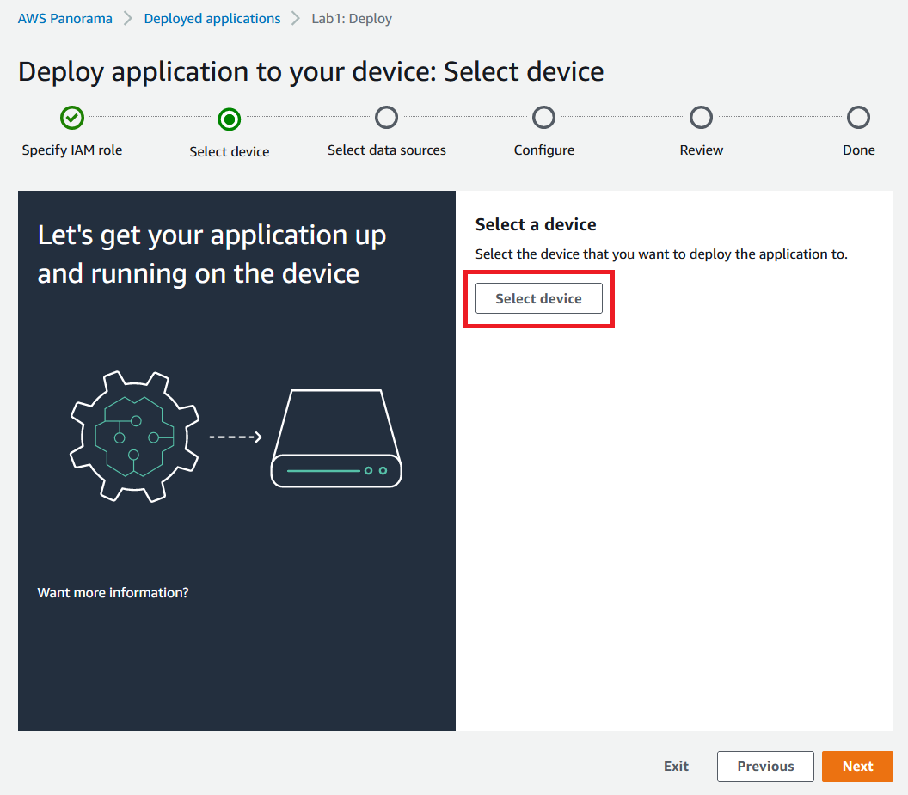
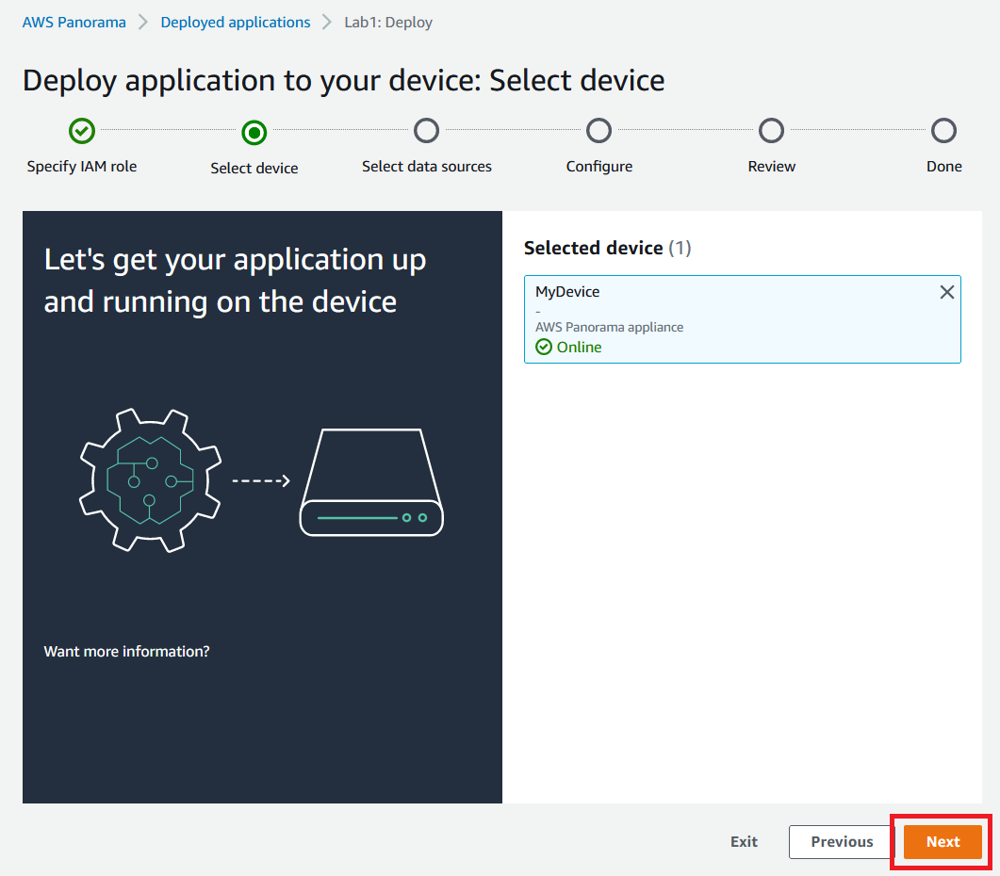
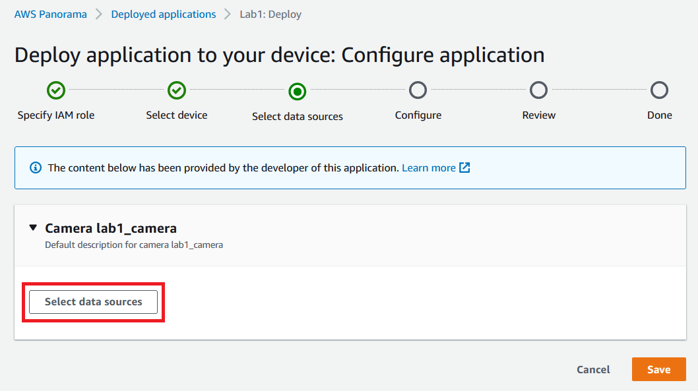
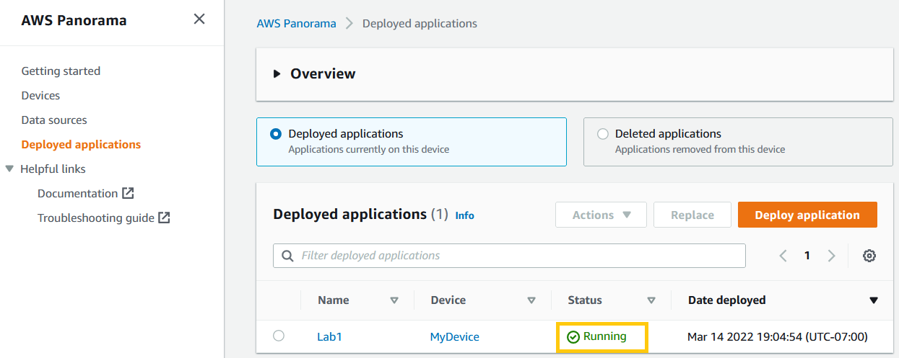
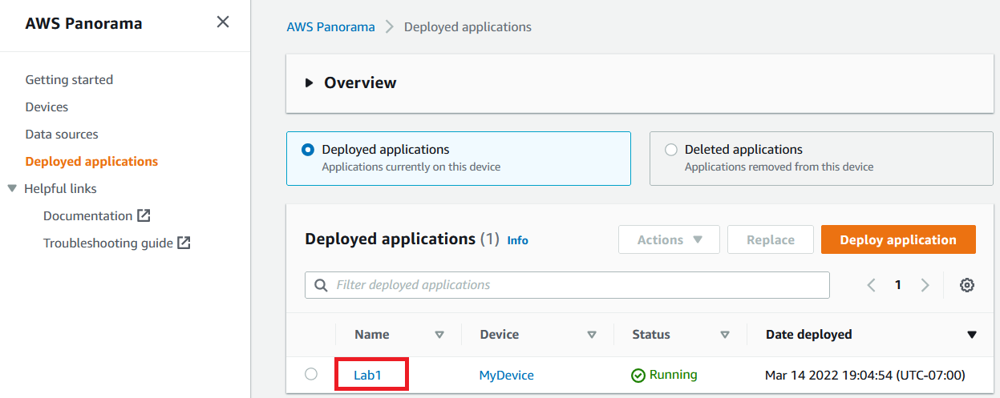
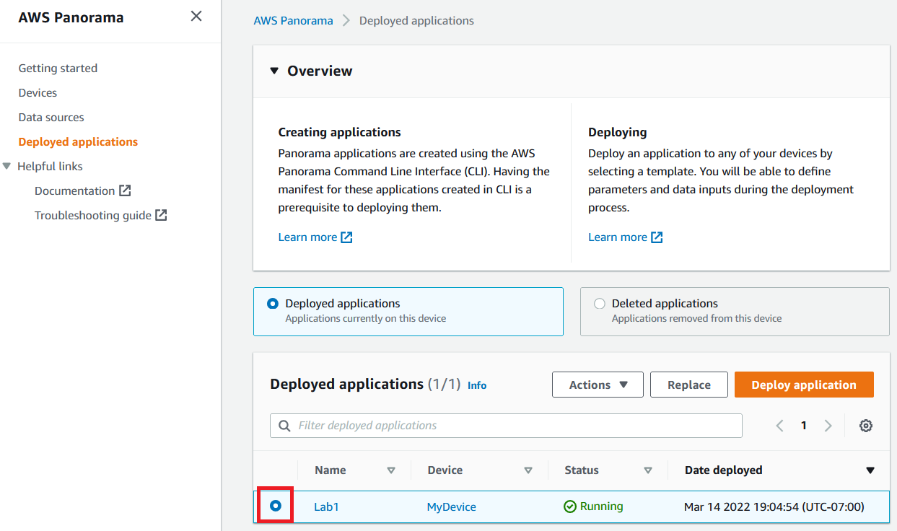

# Lab 3. Object detection with YoloV5s and TensorRT

> **Warning:** Make sure you have performed the steps described in the Lab3.ipynb Prerequisites section before beginning this lab.

## Overview


This lab is an advanced example which will walk a user through step-by-step instructions on how to directly leverage the GPU on the AWS Panorama device and deploy an object detection model that uses YoloV5s and TensorRT. By completing this Lab, in addition to what you learnt in Labs 1 and 2, you will learn
* How to create your own base container image for the ML framework you choose to work with
* Nuances of creating applications that **do not use** the Neo compiler and runtime 
* How to bring your own framework to run applications on the Panorama device
* Using TensorRT to create optimized models that can be deployed on Panorama

**Test Utility** Unlike Lab1 and Lab2, this app does not fully use the Test Utility. It uses it to build and deploy the application but not test the application. 

**panorama-cli** is a command-line utility to help Panorama application developers construct necessary components such as code node, model node, camera node, node packages, container image for code, and node graph structure. It also helps uploading packages to AWS Cloud before deploying application to the device. For more details about panorama-cli, please refer to [this page](https://github.com/aws/aws-panorama-cli).


## How exactly does Open GPU on Panorama work?

In Lab1 and Lab2, you have used a model that was compiled thru the Sagemaker Neo compiler on the device. The Neo compiled model is automatically run on the GPU. But you did not run a non Neo compiled model. 

In Lab3 and Lab4, you will be using frameworks like PyTorch and TensorRT directly on the Panorama device on a custom built container, without compiling these thru Neo 

* **Create Base Docker Image with custom frameworks (Dont have to do this for this lab)**
    * The first step to using Open GPU applications is to create your own base docker image. 
    * Once you run the **download_artifacts_gpu_sample** cell, you should see a dependencies folder downloaded
    * Inside this folder, you will find a docker folder, inside which you will find a Dockerfile
    * You can see that the dockerfile has a base image that includes the Panorama base image
    * You can build this dockerfile like any other dockerfile using something similar to
    
        ``` python
        !sudo docker build -t basedocker:latest . 
        ```


* **Include your model and application code along with the source code(Dont have to do this for this lab)**
    * We also need a model that we should include as part of the deployment
    * This model is converted to a .engine file thru TensorRT before we deploy
    * You can see that after running **download_artifacts_gpu_sample**, an src folder has been created in 
        * lab3/packages/<account-id>-lab3-1.0/src
    * Inside this folder you will see the application code and the model
    * Once you build the container artifacts, we will need to add the following snippet to the package.json file in lab3/packages/<account-id>-lab3-1.0/package.json into the assets section

        ``` json
         "requirements": [
                            {
                                "type": "hardware_access",
                                "inferenceAccelerators": [
                                    {
                                        "deviceType": "nvhost_gpu",
                                        "sharedResourcePolicy": {
                                            "policy": "allow_all"
                                        }
                                    }
                                ]
                            }
                        ]
        ```
    
    The assets section should look something like this after you add it in 
    
    ``` json
                {
                "name": "lab3",
                "implementations": [
                    {
                        "type": "container",
                        "assetUri": "3c748b8349bc4f52d8eabea26ac940d4b7b2a2261cfb1b8d4108c9eecddad1a2.tar.gz",
                        "descriptorUri": "566bde2a6527ce45ec3300a90a24b5022d780816099a94fcc9545ef14eccd9a9.json",
                        "requirements": 
                            [{
                                "type" : "hardware_access",
                                "inferenceAccelerators": [ 
                                    {
                                        "deviceType": "nvhost_gpu",
                                        "sharedResourcePolicy": {
                                            "policy" : "allow_all"
                                        }
                                    }
                                ]
                            }]
                    }
                ]
            }
    
    ```


    
* **Build and upload Container artifacts using panorama-cli build (Dont have to do this for this lab)**
    * Once we have all the steps above done, you are now ready to build the container artifacts
    * Inside the lab3/packages/<account-id>-lab3-1.0 you will see another Dockerfile
    * Inside this dockerfile, we have imported the base image we build in the first step and also mounted the src folder to /panorama folder on the device 
    * We build this container artifacts using panorama-cli build
    * This will create two files
        * One .sqfs file
        * One .json file
    * These two files will be uploaded to the Panorama cloud and downloaded to the device
    * **These files have already been created for you in the interest of time**


## How to open and run notebook

This Lab uses SageMaker Notebook environment. 
1. Visit [SageMaker Notebooks instances page](https://console.aws.amazon.com/sagemaker/home#/notebook-instances) and find "PanoramaWorkshop". Click "Open JupyterLab". 
1. In the file browser pane in left hand side, locate "aws-panorama-immersion-day" >  "labs" > "3. Object detection GPU" > "Lab3.ipynb", and double click it. Notebook opens.
1. Choose conda_python3 as the Notebook kernel
1. Select the first cell, and hit Shift-Enter key to execute a single selected cell and move to next cell.


## Download Artifacts


1. Open the included Lab3.ipynb notebook. Hit **Shift-Enter**, and execute the first code cell **"Set Up"**. This cell imports necessarily Python modules for this Lab.
    ``` python
        import sys
        import os
        import time
        import json

        import boto3
        import sagemaker

        import matplotlib.pyplot as plt
        from IPython.core.magic import register_cell_magic

        sys.path.insert( 0, os.path.abspath( "../common/test_utility" ) )
        import panorama_test_utility

        # instantiate boto3 clients
        s3_client = boto3.client('s3')
        panorama_client = boto3.client('panorama')  
    ```

2. Create Notebook Parameters next (**Shift-Enter**)

    ``` python
        # application name
        app_name = 'lab3'

        ## package names and node names
        code_package_name = 'lab3'
        camera_node_name = 'abstract_rtsp_media_source'

        # AWS account ID
        account_id = boto3.client("sts").get_caller_identity()["Account"]
    ```
    
3. Once we create the above parameters, we now replace the account id's / import our application. (**Shift-Enter**)

    ``` python
    !cd ./lab3 && panorama-cli import-application
    ```
    
4. At this point we can start downloading the dependencies (Base Docker file) and the source code. Run this cell with **Shift-Enter**. This step will download the following


    ``` python
    panorama_test_utility.download_artifacts_gpu_sample('lab3', account_id)
    ```
    
    * The base image lab3_base_image.tar.gz
    * Load the above base image 
    * Download the applciation artifacts
    

## Create Camera

1. This step was already done in Lab1, so you wont need to do this again. You can use the camera that you created in Lab 1 for this


## Build Application Container 

1. Run cell that says the following with **Shift-Enter**

    ``` python
    container_asset_name = 'lab3'
    ```

2. Generally at this point, we build the application container artifacts using the panorama-cli build. **(THIS HAS ALREADY BEEN DONE FOR YOU FOR THIS LAB)**

This step takes around 10 to 20 minutes

``` python
!cd ./lab3 && panorama-cli build \
    --container-asset-name {container_asset_name} \
    --package-path packages/{account_id}-{code_package_name}-1.0
```
    
3. At this point, we are ready to upload the application. Execute this cell with **Shift+Enter**

   ``` python
        !cd ./lab3 && pwd && panorama-cli package-application

    ```
    
    This should start uploading and registering the packages with the Panorama cloud
    

## Deployment

 > Note: You can deploy applications using API/CLI as well. This was shown in Lab 2.
 
1. Open https://console.aws.amazon.com/panorama/home#deployed-applications, and click "Deploy aplication" button.
        
    
    
1. "Copy your application manifest" dialog appears. Open "./lab3/graphs/lab3/graph.json" with Text editor, and copy the contents to the clipboard, and click "Ok" button.

    

1. Paste the contents of graph.json, and click "Next" button.

    

1. We will reuse the deployment details from Lab1 but please use input application name "Lab3", and click "Proceed to deploy" button. 

    

1. "Panorama pricing" dialog appears. This is a confirmation how cost for AWS Panorama is charged. Click "Continue" button.

    
    
 > Note: A lot of the deployments are common to Lab 1. So we will be using some instructions in Lab1 here

1. Click "Begin deployment" button.

    

1. IAM Role can be empty for this application. Click "Next" button.

    

1. Click "Select device" button.

    

1. Choose your device, and click "Select" button.

    

1. Confirm the selected device, and click "Next" button.

    

1. Confirm the selected device, and click "Next" button.

    

1. Click "View input(s)" button.

    

1. Click "Select data sources" button.

    

1. Select the data source, and click "Save" button.

    

1. Confirm the selected data source, and click "Save" button.

    

1. Click "Next" button.

    

1. Click "Next" button.

    

1. Click "Deploy" button.

    

1. Deployment process starts. Click "Done" button.

    

1. You can monitor the deployment status on the application list screen.

    

1. Wait until the status changes to "Running".

    

1. Check HDMI output (If HDMI display is available)

    1. Connect your HDMI display with the Panorama appliance device.
    1. Confirm that camera image and bounding boxes are visible on the display.
    
1. At this point you should see output on your screen like below. 

> Note: We used an emulated Camera stream that was streaming a video as an RTSP stream.


1. Check application logs on CloudWatch Logs

    1. Open https://console.aws.amazon.com/panorama/home#deployed-applications, and click the deployed application.

        

    1. Copy the application instance ID to the clipboard.

        

    1. Open https://console.aws.amazon.com/cloudwatch/home#logsV2:log-groups, and search for a log group which contains the application instance ID. Click it.

        
    
    1. Find a log stream "console_output", click it.

        

    1. Confirm logs from application are visible.

        

1. Delete the application.

    Once you confirmed that the application is running as expected, let's delete the application before moving to next Labs.

    1. Open https://console.aws.amazon.com/panorama/home#deployed-applications, and select the application.

        

    1. From the "Actions" drop-down menu, choose "Delete from device".

        

    1. Input the application name "Lab1", and click "Delete".

        

    1. Application status changes to "Deleting".

        

    1. Wait until the application disappears from the list.

        

## Conclusion

By completing this Lab, you have learned how to use the panorama-cli and the Panorama appliance to deploy a non Neo compiled TensorRT optimized model to the edge. You learnt how to use the GPU directly with an open source framework like TensorRT and PyTorch
    
> **Note:** Before proceeding to the next lab, please select "Kernel" > "Shut Down Kernel" from the menu bar to shut down the Jupyter kernel for this notebook, and free up memory.